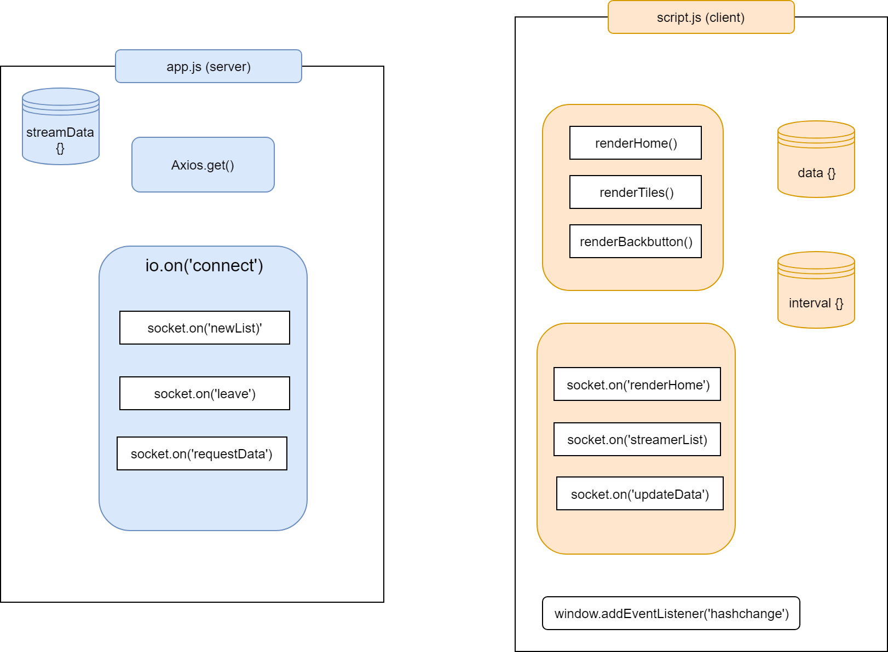
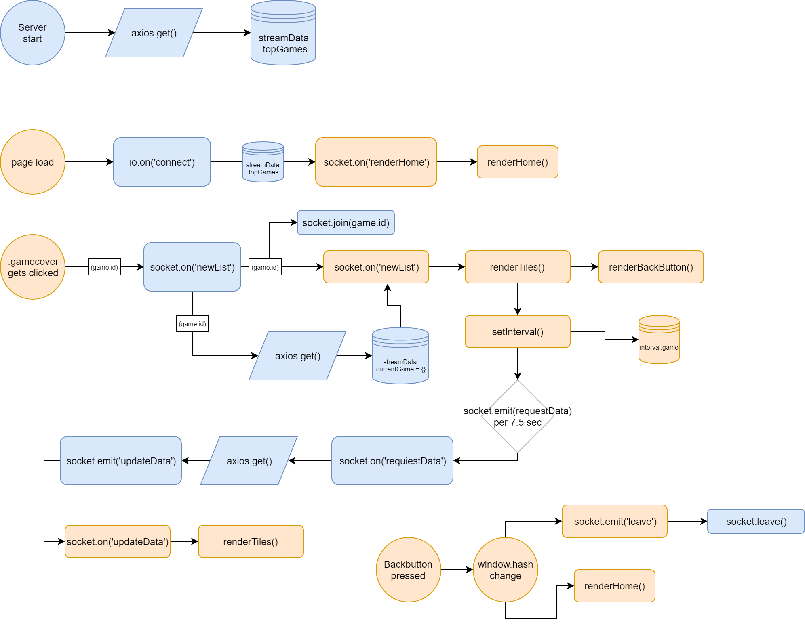
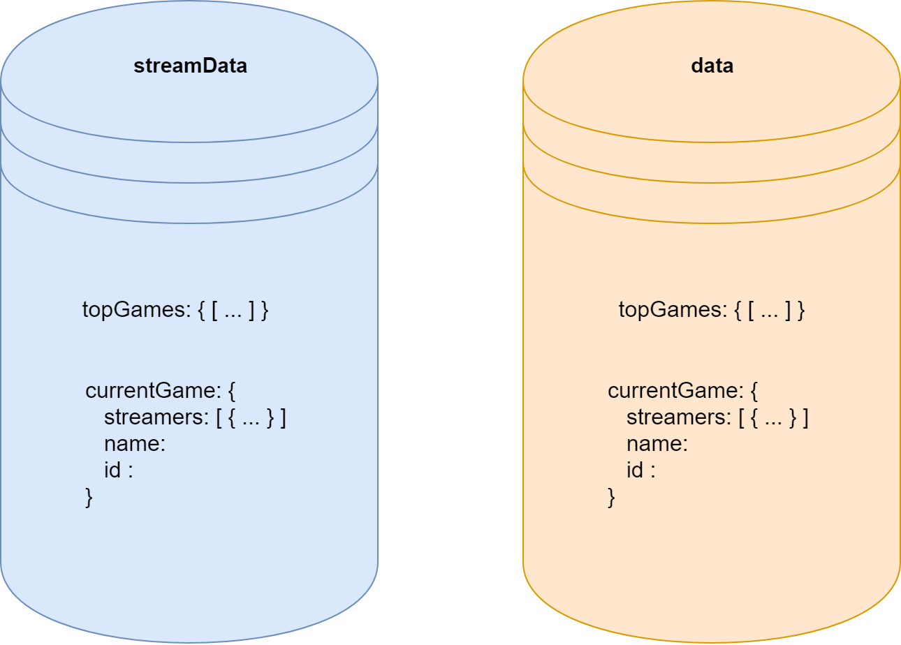

# Real time app: Stream-viewers

This app uses the [Twitch API](https://dev.twitch.tv/docs/api/) to request the top 20 most viewed games. It shows the 12 most viewed (currently watching) streamers for every game. These viewer counts update in **_real time_** with the use of websockets.


## How to run

You can install locally the app by running

```bash
git clone https://www.github.com/daoneandonly/real-time-web-1819.git

npm install
```

Followed by starting the app

```bash
npm start
```

The app will run locally on `localhost:3000`

## live demo

You can view a live demo [here](https://stream-viewers.herokuapp.com).

---

## Table of Contents

- [Introduction](#Introduction)
- [Diagrams](#Diagrams)
- [Rate limits](#Ratelimits)
- [To do/ future](#To-do-/-future)

---

## Introduction

This app has been made for the minor Web-development at Communication and Multimedia Design at the Univeristy of Applied Sciences of Amsterdam.
This course was an introduction to real time web with the use of websockets using [socket.io](https://www.socket.io).

The app consist of a node.js server and some client side javascript to handle the sockets.

## Diagrams

The following diagrams show my inner working of the code in a schematic fashion.


_All core functions both server and client side_.


_The flow of the application._


_The structure of the data objects both server and client side._

## Rate limits

The twitch API has a rate limit of 30 per minute. This app polls every 7.5 seconds. So, assuming every user only polls **one** request it should serve about 15-20 people simultaneously.

## To do / future

This app could improve in a few ways.

- Currently it uses polling on a `setInterval()`. I've found out through ~~very obvious~~ research that polling is **highly** discouraged. The use of webhooks is mentioned as an alternative, so that should something I should look in to.

- Polling happens clientside. Eventhough polling shouldn't be done at all, it seems safer to do this server-side since you could easily exploit the polling with a higher pollingrate and therefore exceeding the ratelimit.

* The server only requests the top 20 games once, on server startup. Preferably this happens once every few hours, to keep in line with being 'live' data. For now this app is mostly for local and private use, so the rate is fine

* While the most viewed streamers are cool, It'd be great to have a way to show lesser viewed streamers aswell. The Twitch API offers pagenation which could be used to browse the results.
